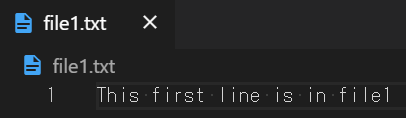
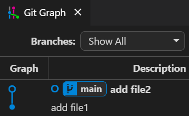
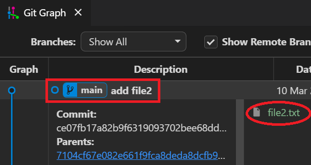

Hands-on lab  
Mar 2021

# **Exercise 1 回答**

1. C:\gitroot\firstRepo がリポジトリになっていること
  
2. file1.txt が Commit されていてファイルの内容が指示通りであること
   
3. file2.txt が Commit されていてファイルの内容が指示通りであること
   
4. Commit ログが２つあり、最初の Commit には file1.txt だけが保持されており、２つ目の Commit には file2.txt が保持されていること
   

   

   

***

# **Exercise 2 回答**
