Hands-on lab  
Mar 2021

# **Exercise 1 回答**

- C:\gitroot\firstRepo がリポジトリになっていること  

  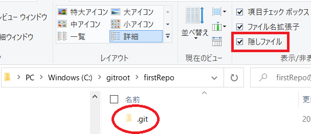

- file1.txt が Commit されていてファイルの内容が指示通りであること  

    

- file2.txt が Commit されていてファイルの内容が指示通りであること  

  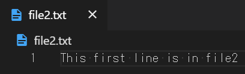  

- Commit ログが２つあり、最初の Commit には file1.txt だけが保持されており、２つ目の Commit には file2.txt が保持されていること  

   

  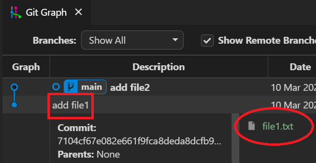 

  

***

# **Exercise 2 回答**

- Commit ログは下図と同じであること  

  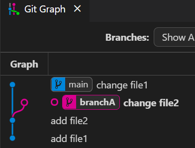  

- BranchA に Commit が１つあり file2.txt の内容が以下の通りであること  

  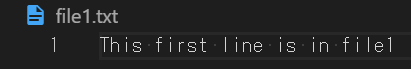  

- main に Commit が３つあり file1.txt の内容が以下の通りであること  

  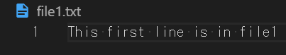

***

# **Exercise 3 回答**

- merge が完了すること( Commit ログが下図と同じであること)  
  - Conflict が発生しなかったこと
  - BranchA が削除されていること  

  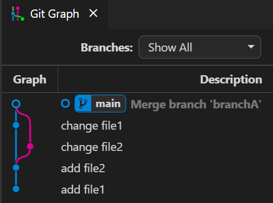

- file1.txt の内容が下記になっていること  

  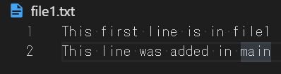

- file2.txt の内容が下記になっていること  
  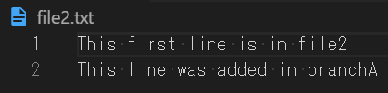

***

# **Exercise 4 回答**

- merge が完了すること( Commit ログが下図と同じであること)  
  - Conflict が発生したこと
  - Branchb が削除されていること  

  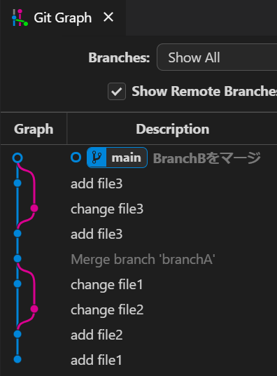

- file3.txt の内容が下記になっていること  

  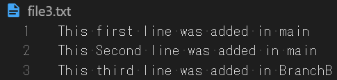

***

# **Exercise 5 回答**

- Fast-forward merge だったこと( Commit ログが下図と同じであること)  
- main と BranchC が最新の Commit であること

  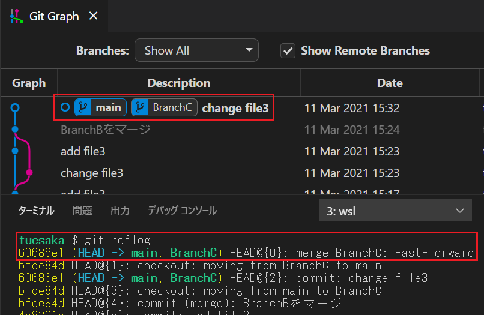

***

# **Exercise 6 回答**

***

# **Exercise 7 回答**

***

# **Exercise 8 回答**

***

# **Exercise 9 回答**

***

# **Exercise 10 回答**

***

# **Exercise 11 回答**
